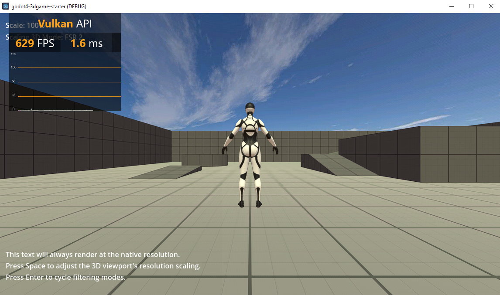
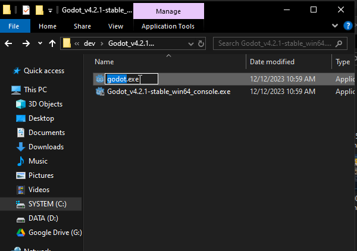

# Goto 4.2 - Game Starter

[](https://opensource.org/licenses/MIT)
[](https://twitter.com/Damien_Fremont)
[](https://www.buymeacoffee.com/damienfremont)

:warning: **WORK IN PROGRESS !!!**

2024's small template to start your godotgame. Featuring Unreal ThirdPerson example.

<p align="center">
  
</p>

## Content

  - [Screenshots](#screenshots)
  - [Features](#features)
  - [Install](#install)
  - [Usage](#usage)
  - [Resources](#resources)

---------------------------------------

## Screenshots




## Features

- Targets:
  - [x] Win64 (Windows)
- Graphics
  - :hourglass: Render: [ ] PostProcessing Bloom, Filter FSR2
  - [ ] Camera: ThirdPerson
  - :hourglass: Lighting: Real Time, [ ] Player Shadows
  - [x] Meshes: Meshes, Textures, Shaders, Materials
  - :hourglass: Sky: Color, Cubemap, [ ] Fog
- World
  - [ ] Physics: [ ] hitbox, [ ] gravity
  - [ ] Simulation: Tick Systems
- Scripting
  - [ ] Console
- Animation
  - [ ] Character
- Input
  - [ ] UI: lauch screen, settings menu
  - [ ] Control: Keyboard, Tank control
- Other
  - [x] launching screen

Repository layout:
```
├── assets
│   └── images
│   └── ...
├── docs
├── standalone
│   ├── desktop_win64
└── tools
│   └── ci
```

## Install

### Windows

1. [Download Godot 4 for Windows](https://godotengine.org/download/windows/)
2. Unzip Godot

### CI

Add Godot to classpath




## Usage

### Windows

1. Start Godot.exe
2. Import > `godot4-3dgame-starter`

### CLI

- Pros: basic, no Editor, CI friendly.
- Cons: manual actions intensive.

```powershell
.\tools\ci\release.bat
```

## Resources

- Godot
  - [Command line tutorial](https://docs.godotengine.org/en/stable/tutorials/editor/command_line_tutorial.html#exporting)
  - Youtube
    - [Cheap Sky from AI-Generated (or Any Other) Image in 5 Min / Godot Tutorial](https://www.youtube.com/watch?v=ie-D7q7zczY)
    - [Exporting 3D Models to Godot 4 | GlTF settings](https://www.youtube.com/watch?v=_eIAl_HZWXM)
- Resources
  - [Poly Haven | Skies > Partly Cloudy](https://polyhaven.com/hdris/skies/partly%20cloudy)